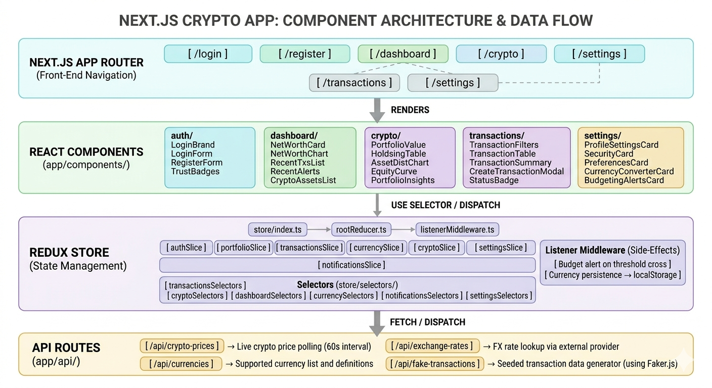

# WealthLedger

Institutional private wealth management portal built with Next.js, Redux Toolkit, and Tailwind CSS.

## Tech Stack

| Layer | Technology |
|---|---|
| Framework | Next.js 16 (App Router) |
| Language | TypeScript 5 |
| State Management | Redux Toolkit 2 + React-Redux 9 |
| Styling | Tailwind CSS 3 |
| Data Generation | @faker-js/faker |

## Architecture Diagram

## Data Flow

```
User Action
    │
    ▼
Component (dispatch action)
    │
    ├──► listenerMiddleware  ──► Side-effects
    │         (budget alerts, localStorage persistence)
    │
    ▼
Slice reducer (updates state)
    │
    ▼
createSelector memoized selector
    │
    ▼
Component re-renders with new data
```

## Project Structure

```
wealth-ledger/
├── app/                    # Next.js App Router pages
│   ├── api/                # API route handlers
│   ├── dashboard/
│   ├── crypto/
│   ├── transactions/
│   ├── settings/
│   ├── login/
│   └── register/
├── components/             # React UI components (feature-grouped)
│   ├── auth/
│   ├── dashboard/
│   ├── crypto/
│   ├── transactions/
│   └── settings/
├── store/                  # Redux Toolkit state
│   ├── slices/             # State slices
│   ├── selectors/          # Memoized selectors
│   ├── rootReducer.ts      # Combined reducer + RootState
│   ├── listenerMiddleware.ts
│   └── index.ts            # Store config + AppDispatch
└── lib/                    # Hooks and utilities
    ├── useCurrencyFormat.ts
    └── usePricePoll.ts     # 60-second price polling
```

## Getting Started

```bash
npm install
npm run dev
```

Open [http://localhost:3000](http://localhost:3000) and navigate to `/login`.

## Key Patterns

**Selector-only components** — all business logic lives in `store/selectors/`; components call `useSelector` with no inline computation.

**CSS custom properties for dynamic styles** — runtime values are passed as `style={{ '--var': value }}` and consumed by Tailwind arbitrary classes (`[width:var(--w)]`), keeping `className` strings static.

**Circular dependency prevention** — `store/rootReducer.ts` owns `RootState`; both `store/index.ts` and `store/listenerMiddleware.ts` import from it rather than from each other.

**Budget alerts via listener middleware** — `listenerMiddleware` compares `getOriginalState()` vs `getState()` to detect the exact tick when spending crosses the threshold, dispatching a notification only on that transition.
